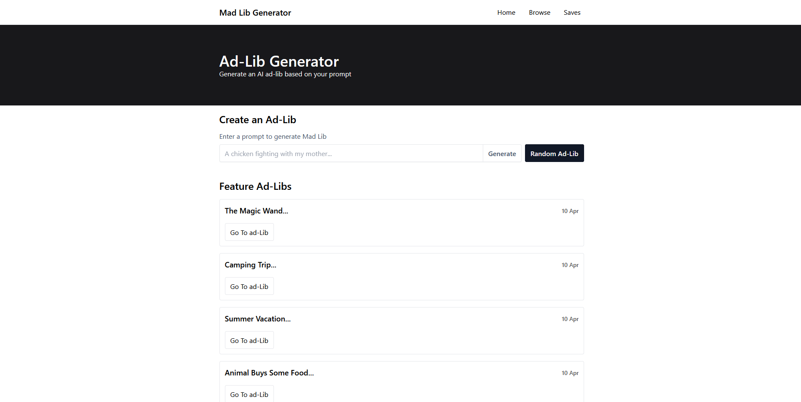
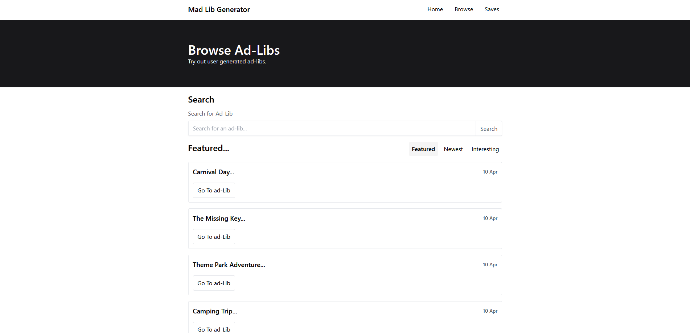
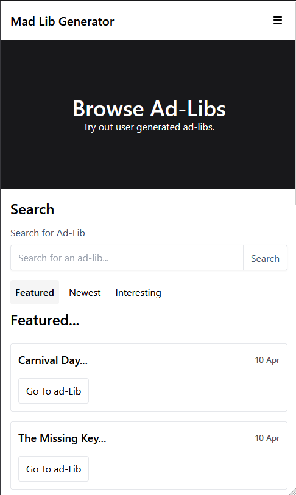

# ai-ad-libs

- An application that allows users to generate ad-libs using ai based on user prompt.

- This application was built with React, Vite, Express, Node.js, JavaScript, Tailwindcss, Mongodb, Mongoose, and openai's api.

- This application allows users to save ad-libs created for later use. This application also allows users to browse featured, most recent, and interesting ad-libs created by users.

- Part of Ai-wranglers Hackathon by Don the Developer.

## Deployed version

- [aiadlibs](https://aiadlibs.com/)

## Screenshots

 
Desktop View

 
 
 
Mobile View

 

## Authors

- Anthony Mclamb

- Zhi Zheng

## Version History

-1.0 Initial Release

## Acknowledgments

- Credit to openai's open source software.
- Acknowledgment to Don the Developer for hosting the hackathon.
